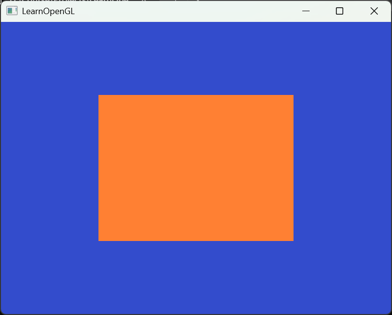

# LearnOpenGL
记录自己学习 [LearnOpenGL](https://learnopengl.com/) 的过程

## 运行结果


## OpenGL<font color=green>图形渲染管线</font>（Graphics Pipeline）
图形渲染管线可以被划分为 **两个** 主要部分：
1. 把你的3D坐标转换为2D坐标
2. 把2D坐标转变为实际的有颜色的像素

<div style="background-color:#d8f5d8; padding: 10px; border-radius: 10px; color: black;">
  2D坐标和像素也是不同的，2D坐标精确表示一个点在2D空间中的位置，而2D像素是这个点的近似值，2D像素受到你的屏幕/窗口分辨率的限制。
</div>
</br>

图形渲染管线接受一组3D坐标，然后把它们转变为你屏幕上的有色2D像素输出。图形渲染管线可以被划分为几个阶段，每个阶段将会 **把前一个阶段的输出作为输入** 。所有这些阶段都是高度专门化的（它们都有一个特定的函数），并且很容易并行执行。

图形渲染管线的每个阶段的抽象展示。蓝色部分代表的是我们可以注入 **自定义的着色器** 的部分。


图形渲染管线的第一个部分是<font color=green>顶点着色器</font>(Vertex Shader)，它把一个单独的顶点作为输入。顶点着色器主要的目的是把3D坐标转为另一种3D坐标（后面会解释），同时顶点着色器允许我们对顶点属性进行一些基本处理。

顶点着色器阶段的输出可以选择性地传递给<font color=green>几何着色器</font>(Geometry Shader)。几何着色器将一组顶点作为输入，这些顶点形成图元，并且能够通过发出新的顶点来形成新的(或其他)图元来生成其他形状。在这个例子中，它从给定的形状中生成第二个三角形。

<font color=green>图元装配</font>(Primitive Assembly)阶段将顶点着色器（或几何着色器）输出的所有顶点作为输入（如果是GL_POINTS，那么就是一个顶点），并将所有的点装配成指定图元的形状；本节例子中是两个三角形。

图元装配阶段的输出会被传入<font color=green>光栅化阶段</font>(Rasterization Stage)，这里它会把图元映射为最终屏幕上相应的像素，生成供片段着色器(Fragment Shader)使用的片段(Fragment)。在片段着色器运行之前会执行<font color=green>裁切</font>(Clipping)。裁切会丢弃超出你的视图以外的所有像素，用来提升执行效率。

<div style="background-color:#d8f5d8; padding: 10px; border-radius: 10px; color: black;">
  OpenGL中的一个片段是OpenGL渲染一个像素所需的所有数据。
</div>
</br>

<font color=green>片段着色器</font>的主要目的是计算一个像素的最终颜色，这也是所有OpenGL高级效果产生的地方。通常，片段着色器包含3D场景的数据（比如光照、阴影、光的颜色等等），这些数据可以被用来计算最终像素的颜色。

在所有对应颜色值确定以后，最终的对象将会被传到最后一个阶段，我们叫做<font color=green>Alpha测试</font>和<font color=green>混合</font>(Blending)阶段。这个阶段检测片段的对应的深度（和模板(Stencil)）值（后面会讲），用它们来判断这个像素是其它物体的前面还是后面，决定是否应该丢弃。这个阶段也会检查<font color=green>alpha</font>值（alpha值定义了一个物体的透明度）并对物体进行<font color=green>混合</font>(Blend)。所以，即使在片段着色器中计算出来了一个像素输出的颜色，在渲染多个三角形的时候最后的像素颜色也可能完全不同。

在现代OpenGL中，我们**必须**定义至少一个顶点着色器和一个片段着色器（因为GPU中没有默认的顶点/片段着色器）。

### 顶点输入
OpenGL不是简单地把**所有的**3D坐标变换为屏幕上的2D像素；OpenGL仅当3D坐标在3个轴（x、y和z）上-1.0到1.0的范围内时才处理它。所有在这个范围内的坐标叫做<font color=green>标准化设备坐标</font>(Normalized Device Coordinates)，此范围内的坐标最终显示在屏幕上（在这个范围以外的坐标则不会显示）。

一旦你的顶点坐标已经在顶点着色器中处理过，它们就应该是**标准化设备坐标**了，标准化设备坐标是一个x、y和z值在-1.0到1.0的一小段空间。下面你会看到我们定义的在标准化设备坐标中的三角形(忽略z轴)：


与通常的屏幕坐标**不同**，y轴正方向为向上，(0, 0)坐标是这个图像的中心，而不是左上角。最终你希望所有(变换过的)坐标都在这个坐标空间中，否则它们就不可见了。

通过使用由`glViewport`函数提供的数据，进行<font color=green>视口变换</font>(Viewport Transform)，<font color=green>标准化设备坐标</font>(Normalized Device Coordinates)会变换为<font color=green>屏幕空间坐标</font>(Screen-space Coordinates)。所得的屏幕空间坐标又会被变换为片段输入到片段着色器中。定义这样的顶点数据以后，我们会把它作为输入发送给图形渲染管线的第一个处理阶段：顶点着色器。它会在GPU上创建内存用于储存我们的顶点数据，还要配置OpenGL如何解释这些内存，并且指定其如何发送给显卡。顶点着色器接着会处理我们在内存中指定数量的顶点。

我们通过<font color=green>顶点缓冲对象</font>(Vertex Buffer Objects, VBO)管理这个内存，它会在GPU内存（通常被称为显存）中储存大量顶点。使用这些缓冲对象的好处是我们可以 **一次性的发送一大批数据** 到显卡上，而不是每个顶点发送一次。

我们可以使用`glGenBuffers`函数生成一个带有缓冲ID的VBO对象：
```cpp
unsigned int VBO;
glGenBuffers(1, &VBO);
```
OpenGL有很多缓冲对象类型，顶点缓冲对象的缓冲类型是`GL_ARRAY_BUFFER`。OpenGL允许我们同时绑定多个缓冲，只要它们是不同的缓冲类型。我们可以使用`glBindBuffer`函数把新创建的缓冲绑定到`GL_ARRAY_BUFFER`目标上：
```cpp
glBindBuffer(GL_ARRAY_BUFFER, VBO);  
```
从这一刻起，我们使用的任何（在`GL_ARRAY_BUFFER`目标上的）缓冲调用都会用来配置当前绑定的缓冲(VBO)。然后我们可以调用`glBufferData`函数，它会把之前定义的顶点数据复制到缓冲的内存中：
```cpp
glBufferData(GL_ARRAY_BUFFER, sizeof(vertices), vertices, GL_STATIC_DRAW);
```
`glBufferData`是一个专门用来把用户定义的数据复制到当前绑定缓冲的函数。它的第一个参数是目标缓冲的类型：顶点缓冲对象当前绑定到`GL_ARRAY_BUFFER`目标上。第二个参数指定传输数据的大小(以字节为单位)；用一个简单的`sizeof`计算出顶点数据大小就行。第三个参数是我们希望发送的实际数据。

第四个参数指定了我们希望显卡如何管理给定的数据。它有三种形式：
- `GL_STATIC_DRAW`：数据不会或几乎不会改变。
- `GL_DYNAMIC_DRAW`：数据会被改变很多。
- `GL_STREAM_DRAW`：数据每次绘制时都会改变。

三角形的位置数据不会改变，每次渲染调用时都保持原样，所以它的使用类型最好是`GL_STATIC_DRAW`。如果，比如说一个缓冲中的数据将频繁被改变，那么使用的类型就是`GL_DYNAMIC_DRAW`或`GL_STREAM_DRAW`，这样就能确保显卡把数据放在能够高速写入的内存部分。

### 顶点着色器
```glsl
#version 330 core
layout (location = 0) in vec3 aPos;

void main()
{
    gl_Position = vec4(aPos.x, aPos.y, aPos.z, 1.0);
}
```

### 编译着色器
我们首先要做的是创建一个着色器对象，注意还是用ID来引用的。所以我们储存这个顶点着色器为`unsigned int`，然后用`glCreateShader`创建这个着色器：
```cpp
unsigned int vertexShader;
vertexShader = glCreateShader(GL_VERTEX_SHADER);
```
我们把需要创建的着色器类型以参数形式提供给`glCreateShader`。由于我们正在创建一个顶点着色器，传递的参数是`GL_VERTEX_SHADER`。

下一步我们把这个着色器源码附加到着色器对象上，然后编译它：
```cpp
glShaderSource(vertexShader, 1, &vertexShaderSource, NULL);
glCompileShader(vertexShader);
```
`glShaderSource`函数把要编译的着色器对象作为第一个参数。第二参数指定了传递的源码字符串数量，这里只有一个。第三个参数是顶点着色器真正的源码，第四个参数我们先设置为`NULL`。

### 片段着色器
片段着色器所做的是计算像素最后的颜色输出。
```glsl
#version 330 core
out vec4 FragColor;

void main()
{
    FragColor = vec4(1.0f, 0.5f, 0.2f, 1.0f);
} 
```
片段着色器只需要一个输出变量，这个变量是一个4分量向量，它表示的是最终的输出颜色，我们应该自己将其计算出来。声明输出变量可以使用`out`关键字，这里我们命名为`FragColor`。

编译片段着色器的过程与顶点着色器类似，只不过我们使用`GL_FRAGMENT_SHADER`常量作为着色器类型。

两个着色器现在都编译了，剩下的事情是把两个着色器对象链接到一个用来渲染的<font color=green>着色器程序</font>(Shader Program)中。

#### 着色器程序
着色器程序对象(Shader Program Object)是多个着色器合并之后并最终链接完成的版本。如果要使用刚才编译的着色器我们必须把它们<font color=green>链接</font>(Link)为一个着色器程序对象，然后在渲染对象的时候激活这个着色器程序。已激活着色器程序的着色器将在我们发送渲染调用的时候被使用。

`glCreateProgram`函数创建一个程序，并返回新创建程序对象的ID引用。现在我们需要把之前编译的着色器附加到程序对象上，然后用`glLinkProgram`链接它们：
```cpp
unsigned int shaderProgram;
shaderProgram = glCreateProgram();
glAttachShader(shaderProgram, vertexShader);
glAttachShader(shaderProgram, fragmentShader);
glLinkProgram(shaderProgram);
```

把着色器对象链接到程序对象以后，记得删除着色器对象，我们不再需要它们了：
```cpp
glDeleteShader(vertexShader);
glDeleteShader(fragmentShader);
```

### 链接顶点属性
顶点着色器允许我们指定任何以顶点属性为形式的输入。这使其具有很强的灵活性的同时，它还的确意味着我们必须手动指定输入数据的哪一个部分对应顶点着色器的哪一个顶点属性。所以，我们必须在渲染前指定OpenGL该如何解释顶点数据。

我们的顶点缓冲数据会被解析为下面这样子：

- 位置数据被储存为32位（4字节）浮点值。
- 每个位置包含3个这样的值。
- 在这3个值之间没有空隙（或其他值）。这几个值在数组中紧密排列(Tightly Packed)。
- 数据中第一个值在缓冲开始的位置。

有了这些信息我们就可以使用`glVertexAttribPointer`函数告诉OpenGL该如何解析顶点数据（应用到逐个顶点属性上）了：
```cpp
glVertexAttribPointer(0, 3, GL_FLOAT, GL_FALSE, 3 * sizeof(float), (void*)0);
glEnableVertexAttribArray(0);
```

### 顶点数组对象
<font color=green>顶点数组对象</font>(Vertex Array Object, <font color=green>VAO</font>)可以像顶点缓冲对象那样被绑定，任何随后的顶点属性调用都会储存在这个VAO中。这样的好处就是，当配置顶点属性指针时，你只需要将那些调用执行一次，之后再绘制物体的时候只需要绑定相应的VAO就行了。

<div style="background-color:#ffd2d2; padding: 10px; border-radius: 10px; color: black;">
  OpenGL的核心模式要求我们使用VAO，所以它知道该如何处理我们的顶点输入。如果我们绑定VAO失败，OpenGL会拒绝绘制任何东西。
</div>

一个顶点数组对象会储存以下这些内容：
- `glEnableVertexAttribArray`和`glDisableVertexAttribArray`的调用。
- 通过`glVertexAttribPointer`设置的顶点属性配置。
- 通过`glVertexAttribPointer`调用与顶点属性关联的顶点缓冲对象。

创建一个VAO类似创建一个VBO：
```cpp
unsigned int VAO;
glGenVertexArrays(1, &VAO);
```
要想使用VAO，要做的只是使用`glBindVertexArray`绑定VAO。从绑定之后起，我们应该绑定和配置对应的VBO和属性指针，之后解绑VAO供之后使用。当我们打算绘制一个物体的时候，我们只要在绘制物体前简单地把VAO绑定到希望使用的设定上就行了。
```cpp
// ..:: 初始化代码（只运行一次 (除非你的物体频繁改变)） :: ..
// 1. 绑定VAO
glBindVertexArray(VAO);
// 2. 把顶点数组复制到缓冲中供OpenGL使用
glBindBuffer(GL_ARRAY_BUFFER, VBO);
glBufferData(GL_ARRAY_BUFFER, sizeof(vertices), vertices, GL_STATIC_DRAW);
// 3. 设置顶点属性指针
glVertexAttribPointer(0, 3, GL_FLOAT, GL_FALSE, 3 * sizeof(float), (void*)0);
glEnableVertexAttribArray(0);

[...]

// ..:: 绘制代码（渲染循环中） :: ..
// 4. 绘制物体
glUseProgram(shaderProgram);
glBindVertexArray(VAO);
someOpenGLFunctionThatDrawsOurTriangle();
```
一般当你打算绘制多个物体时，你首先要生成/配置所有的VAO（和必须的VBO及属性指针），然后储存它们供后面使用。当我们打算绘制物体的时候就拿出相应的VAO，绑定它，绘制完物体后，再解绑VAO。

### 第一个三角形
要想绘制我们想要的物体，OpenGL给我们提供了`glDrawArrays`函数，它使用当前激活的着色器，之前定义的顶点属性配置，和VBO的顶点数据（通过VAO间接绑定）来绘制图元。
```cpp
glUseProgram(shaderProgram);
glBindVertexArray(VAO);
glDrawArrays(GL_TRIANGLES, 0, 3);
```
`glDrawArrays`函数：
- 第一个参数是我们打算绘制的OpenGL图元的类型。
- 第二个参数指定了顶点数组的起始索引。
- 最后一个参数指定我们打算绘制多少个顶点。

### 元素缓冲对象
元素缓冲对象(Element Buffer Object，EBO)，也叫索引缓冲对象(Index Buffer Object，IBO)。

与VBO类似，我们先绑定EBO然后用`glBufferData`把索引复制到缓冲里。同样，和VBO类似，我们会把这些函数调用放在绑定和解绑函数调用之间，只不过这次我们把缓冲的类型定义为`GL_ELEMENT_ARRAY_BUFFER`。

注意：我们传递了`GL_ELEMENT_ARRAY_BUFFER`当作缓冲目标。最后一件要做的事是用`glDrawElements`来替换`glDrawArrays`函数，表示我们要从索引缓冲区渲染三角形。使用`glDrawElements`时，我们会使用当前绑定的索引缓冲对象中的索引进行绘制：
```cpp
glBindBuffer(GL_ELEMENT_ARRAY_BUFFER, EBO);
glDrawElements(GL_TRIANGLES, 6, GL_UNSIGNED_INT, 0);
```
- 第一个参数指定了我们绘制的模式，这个和glDrawArrays- 的一样。
- 第二个参数是我们打算绘制顶点的个数，这里填6，也就是说我们一共需要绘制6个顶点。
- 第三个参数是索引的类型，这里是`GL_UNSIGNED_INT`。
- 最后一个参数里我们可以指定EBO中的偏移量（或者传递一个索引数组，但是这是当你不在使用索引缓冲对象的时候），但是我们会在这里填写0。

`glDrawElements`函数从当前绑定到`GL_ELEMENT_ARRAY_BUFFER`目标的EBO中获取其索引。这意味着我们每次想要使用索引渲染对象时都必须绑定相应的EBO，这又有点麻烦。碰巧顶点数组对象也跟踪元素缓冲区对象绑定。在绑定VAO时，绑定的最后一个元素缓冲区对象存储为VAO的元素缓冲区对象。然后，绑定到VAO也会自动绑定该EBO。


<div style="background-color:#ffd2d2; padding: 10px; border-radius: 10px; color: black;">
  当目标是 GL_ELEMENT_ARRAY_BUFFER 的时候，VAO会储存 glBindBuffer 的函数调用。这也意味着它也会储存解绑调用，所以确保你没有在解绑VAO之前解绑索引数组缓冲，否则它就没有这个EBO配置了。
</div>
</br>
<div style="background-color:#d8f5d8; padding: 10px; border-radius: 10px; color: black;">
  **线框模式(Wireframe Mode)**

  要想用线框模式绘制你的三角形，你可以通过 glPolygonMode(GL_FRONT_AND_BACK, GL_LINE) 函数配置OpenGL如何绘制图元。第一个参数表示我们打算将其应用到所有的三角形的正面和背面，第二个参数告诉我们用线来绘制。之后的绘制调用会一直以线框模式绘制三角形，直到我们用 glPolygonMode(GL_FRONT_AND_BACK, GL_FILL) 将其设置回默认模式。
</div>